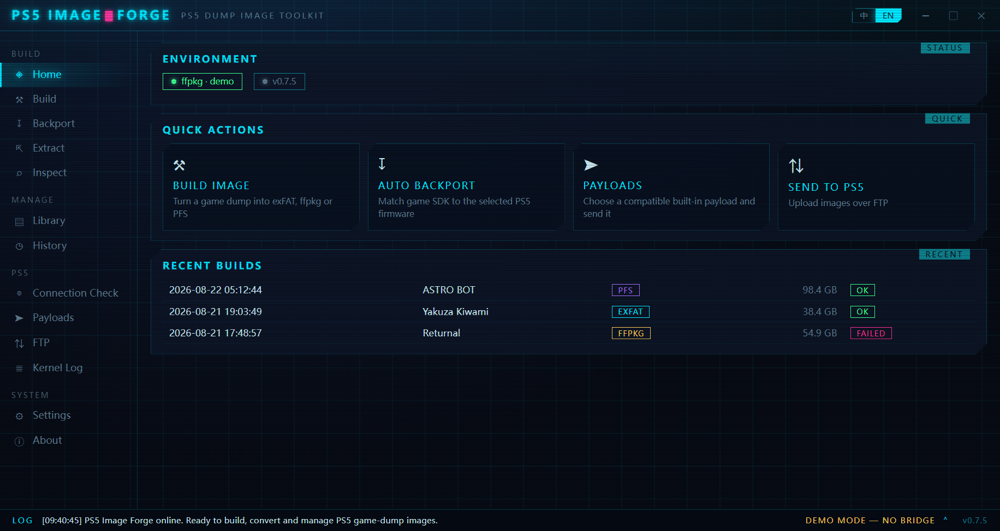
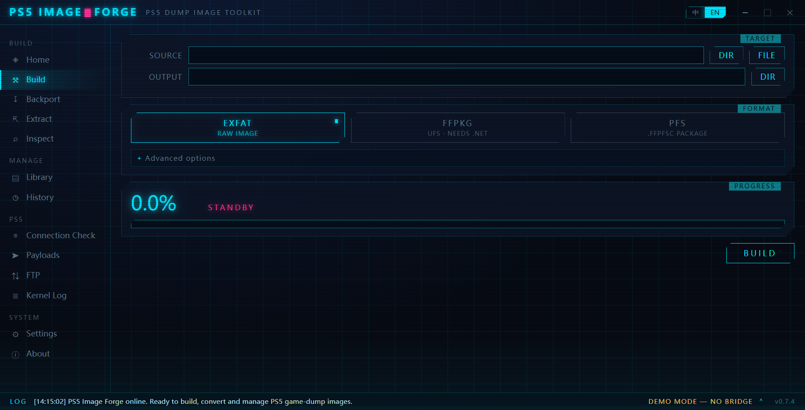
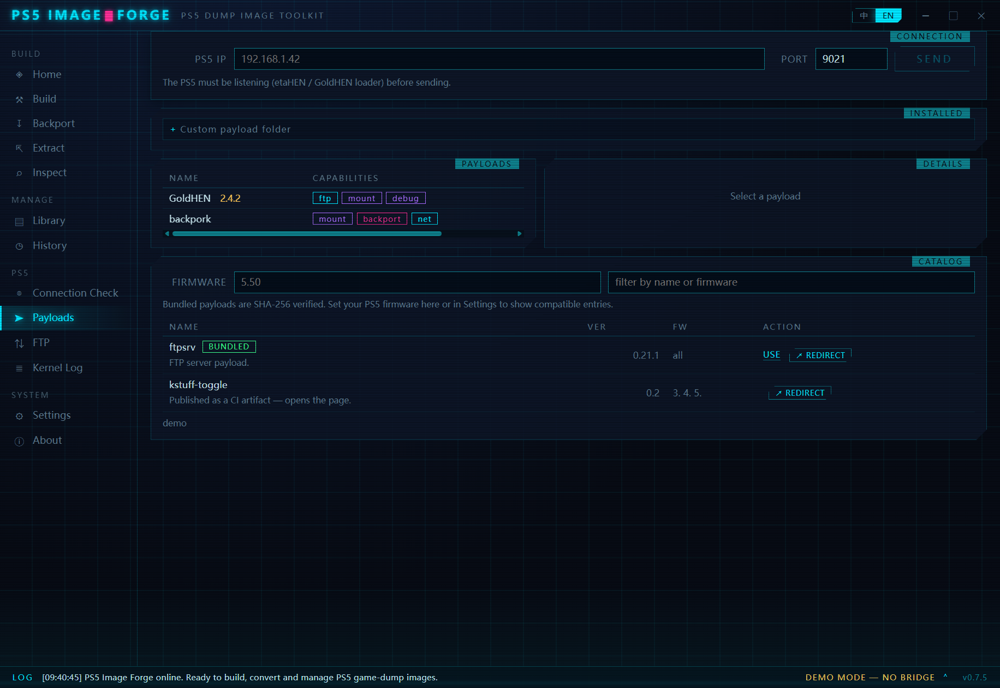
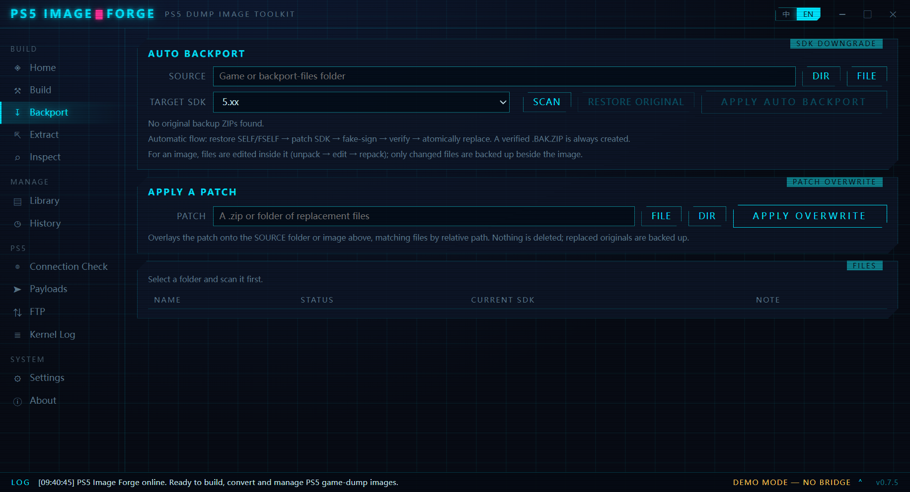

<div align="center">

# PS5 Image Forge

**用于构建、转换、检视与管理 PS5 游戏 dump 镜像的工具集。**

[](https://github.com/freefrank/ps5-image-forge/actions/workflows/release.yml)
[](LICENSE)


[English](README.md) · 简体中文



</div>

---

## 下载

预编译产物随每个 [release](https://github.com/freefrank/ps5-image-forge/releases) 发布（推送 `v*` tag 时自动构建）：

| 产物 | 平台 |
|---|---|
| `PS5-Image-Forge-<版本>-win64-portable.exe` | **Windows** —— 便携版，单文件、免安装 |
| `PS5-Image-Forge-Setup-<版本>.exe` | **Windows** —— 安装版 |
| `PS5-Image-Forge-<版本>-x86_64.AppImage` | **Linux** —— AppImage（需宿主的 `libwebkit2gtk-4.1`） |

## 界面截图

<table>
  <tr>
    <td width="50%"><br><sub><b>构建</b> —— dump → exFAT / ffpkg / PFS</sub></td>
    <td width="50%"><br><sub><b>Payload</b> —— 内置目录，SHA-256 校验</sub></td>
  </tr>
  <tr>
    <td colspan="2"><br><sub><b>Backport</b> —— 还原 SELF/FSELF、SDK 降级、fake-sign、验证</sub></td>
  </tr>
</table>

## 功能

| 页面 | 说明 |
|---|---|
| **首页** | 环境状态、快捷入口、最近构建 |
| **构建** | dump → exFAT / ffpkg / PFS，PFS 可选中间格式，实时遥测 |
| **解包** | 任意格式镜像 → 目录 |
| **检视** | 只读读取镜像结构与文件树 |
| **游戏库** | 扫描并浏览源 dump 与已构建镜像 |
| **历史** | 构建记录（含失败原因） |
| **连接检查** | 扫描一台主机上的常用越狱服务端口，判定是否为越狱 PS5；IP 一处填写，FTP / 内核日志 / Payload 三页自动同步 |
| **FTP** | 连接 PS5、浏览远程目录、上传镜像 |
| **内核日志** | 实时接收 PS5 内核日志 |
| **Payload** | Payload 库：扫描目录、自动读取 ELF 信息与能力、可写备注、发送到 PS5；内置目录可按需从项目 release 下载 |
| **Backport** | 自动还原 SELF/FSELF、降低 SDK、fake-sign 并验证后写回；也支持裸 ELF，修改前默认备份 |
| **设置** | 路径、簇大小、压缩、ffpkg 参数、PS5 连接信息 |

界面为赛博朋克风格（霓虹面板、扫描线、流光进度条），中/英双语实时切换。

## 格式支持

| 格式 | 后端 | 依赖 |
|---|---|---|
| `.exfat` | MkPFS 纯 Python 序列化器（默认簇 64 KiB） | 无 |
| `.ffpfsc` (PFS) | MkPFS，PFSC 块压缩（deflate 1-9） | 无 |
| `.ffpkg` (UFS) | 内置 UFS2Tool | .NET 8 运行时 |

## 安装

```bash
pip install -e .
```

### 单文件 exe

```bash
pip install pyinstaller
python -m PyInstaller PS5-Image-Forge.spec
```

产出单文件 `PS5-Image-Forge.exe`：双击进 GUI；带参数即 CLI；`--selftest` 自检。安装包构建见 [installer/](installer/README.md)。

## CLI

```bash
ps5-image-forge env
ps5-image-forge build E:\PPSA21564-app0 -o D:\PS5
ps5-image-forge build E:\dump -o D:\PS5 -f pfs --level 6
ps5-image-forge build E:\dump -o D:\PS5 -f ffpkg
ps5-image-forge build E:\dump -o D:\PS5 -f pfs --via ffpkg --keep-intermediate
ps5-image-forge compress D:\PS5\PPSA21564.exfat -o D:\PS5\PPSA21564.ffpfsc --level 9
ps5-image-forge backport D:\PS5\PPSA21564.exfat --target 5
ps5-image-forge backport E:\PPSA21564-app0 --overwrite-from D:\patch.zip
ps5-image-forge verify D:\PS5\PPSA21564.exfat --source E:\PPSA21564-app0
ps5-image-forge extract D:\PS5\PPSA21564.ffpfsc D:\unpacked
ps5-image-forge list D:\PS5\PPSA21564.exfat
ps5-image-forge history
ps5-image-forge catalog
```

`compress` 把已有 exFAT 镜像压缩为 PFS（`.ffpfsc`）。`backport` 既能作用于已解包的游戏文件夹，也能直接作用于 `.exfat`/`.ffpfsc`/`.ffpkg` 镜像：镜像会被解包 → 修改 → 重新打包（`--target` 做 SDK 降级；`--overwrite-from` 用一个 zip/文件夹按相对路径覆盖文件）。由于 ROM 可能上百 GB，备份只保存**被改动文件**的原始版本到镜像旁的 `NAME.bak.zip`，用它作为一次覆盖即可还原。

重 IO 的临时/中转数据（压缩、镜像解包/重打包）默认落在输出旁边；库通常在 HDD，可用设置里的**工作目录**（或 CLI `--work-dir`）把它指到 SSD，只有最终镜像写回 HDD。

默认输出文件名来自游戏元数据，格式为 `PPSA_TITLE_VERSION.ext`，例如 `PPSA21564_ASTRO_BOT_01.000.000.ffpfsc`。标题中的 Windows 非法字符会自动清理；将已有 exFAT 镜像转换为 PFS 时也会读取镜像内的 `sce_sys/param.json`，无需先解包。

CLI 消息跟随系统语言，`PS5_IMAGE_FORGE_LANG=en|zh` 可覆盖。

## 开发

```bash
pytest tests/
```

测试覆盖：镜像构建/校验/腐蚀检测/逐字节解包往返、三格式流水线、exFAT→PFS 压缩、镜像内 Backport 与补丁覆盖、设置与历史持久化、库扫描、payload ELF 解析、PS5 协议与端口扫描（本地 socket 模拟真实线路行为）、payload 目录与下载、Backport 扫描/降级/备份与签名文件保护，以及 GUI 的完整后端接口（无窗口驱动）。

UI 可直接在浏览器里开发：

```bash
python -m http.server 8899 -d src/ps5_image_forge/webui
```

无后端时页面进入 demo 模式，用合成数据渲染全部界面。

## Payload 库

把 `.elf` / `.bin` 放进一个目录，在 Payload 页选中该目录扫描即可。每个 payload 的信息**直接从文件本身读取**：ELF 头（架构 / OSABI / 入口）、GNU build-id、编译器，以及从字符串推断的名称、版本与能力标签（ftp / mount / backport / jailbreak 等）。

说明按优先级取：**你写的备注** > 同名 `.txt` / `.md` / `.json` > 从 ELF 自动生成。备注存在 `%APPDATA%/ps5-image-forge/payload_notes.json`，不会改动 payload 文件本身。非 ELF 文件或架构异常的会标黄警告，避免发送必然失败的文件。

Payload 页同时内置一批常用 payload 二进制及完整目录元数据。用户手动选择 PS5 固件后默认只显示兼容项；点“使用”时先按随包清单校验 SHA-256，再原子释放到 payload 目录。每个二进制都固定到目录标注的项目上游 release URL，来源清单位于 `vendor/payloads/manifest.json`。

## Backport 降级

Backport 页可以扫描游戏目录中的 `.bin` / `.elf` / `.self` / `.prx` / `.sprx`，读取 PS5 SDK 要求。裸 ELF 会直接修改；SELF/FSELF 会自动还原为 ELF、把 SDK 降到用户选择的版本（1.00–10.00），再生成 fake-signed SELF。默认先生成并校验 `.bak.zip`，通过“重新还原并检查 SDK”验证后才原子替换原文件。不能可靠还原的容器会报告失败并保持原件不变。

目标 SDK 会跟随设置中的 PS5 固件自动建议。Payload 页同时内置 BestPig 官方 BackPork payload，用于后台 unionfs 覆盖流程：自动 Backport 负责准备 fake-signed 降级文件，BackPork payload 负责在主机端提供覆盖层。

## 开发文档

当前进度、已确定的需求与设计决策、待办事项：[docs/DEVELOPMENT.md](docs/DEVELOPMENT.md)。

## 许可协议

GPL-3.0（跟随 [MkPFS](https://github.com/PSBrew/MkPFS) 上游）。`vendor/ufs2tool/` 内的 UFS2Tool 程序集来自 exFAT Image Builder v4.0.2，详见该目录下的 `PROVENANCE.md`。Auto Backport 使用了 [ps5-payload-dev/sdk](https://github.com/ps5-payload-dev/sdk) 中未修改的 `make_fself.py`；出处、哈希及 GPL-3.0-or-later 文本位于 `src/ps5_image_forge/_vendor/`。
